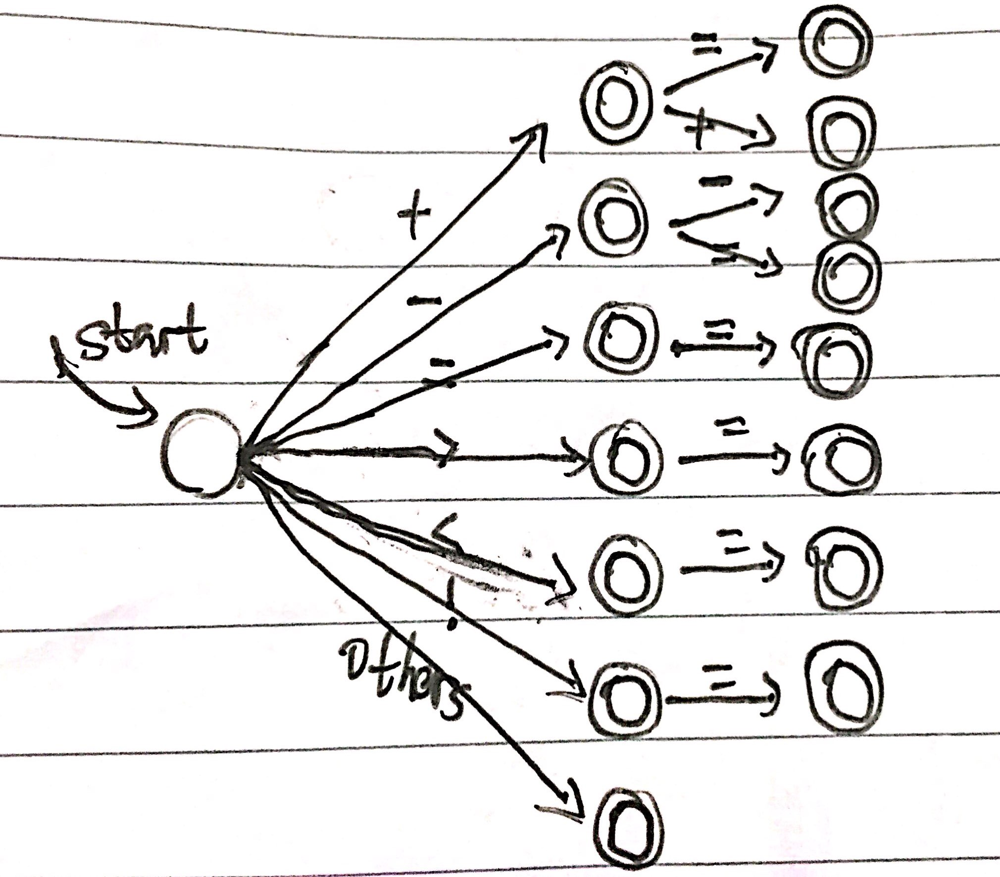
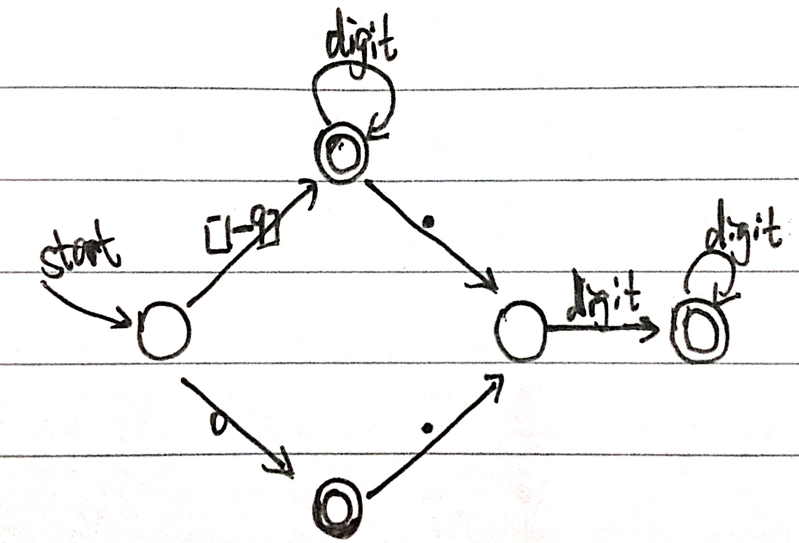
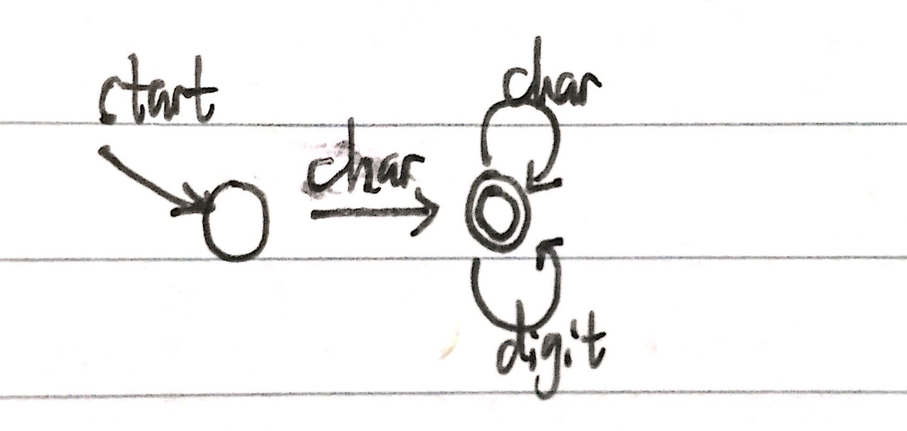
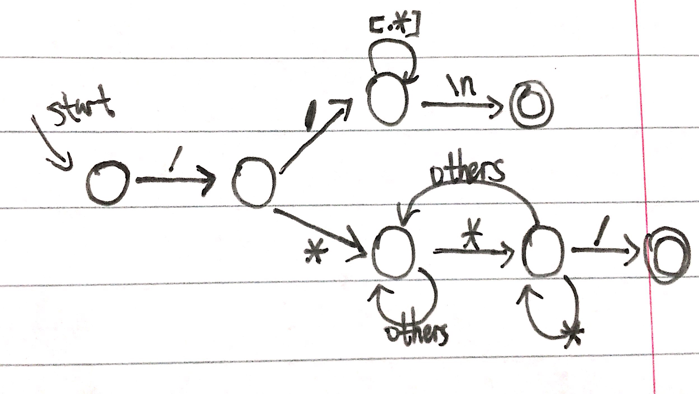

## 基于有限自动机的词法分析器的构造（基于c语言）
##### 软件学院 陈睿 141250013

### 目标
1. 实现对自定义的程序语言的词法分析器程序构造。
2. 我选择C语言当中部分具有代表性的子集，实现词法分析器。
3. 更好地理解从RE->NFA->DFA的过程，并应用到具体的程序语言词法分析中。

### 主要内容
本报告主要描述了一个简单的词法分析器构造过程，包括如下：

- 最终成品
- 实现过程中的理论推导
- 具体的核心算法和数据结构的描述
- 困难与解决，心得

### 环境
- Mac OS
- Clion + MinGW (gcc)
- MakeFile

### 用于分析的c语言定义

1. 符号
	- 默认：默认符号长度为1
	- 特殊：`+=, ==, -=, !=, ++, --, >=, <=`
	- 注释：单行`//`, 多行`/**/`
	- 空白符：`\n, \t, space`
2. 标识符
	- 默认：以字母开头，后面可以加字母和数字
	- 保留字：根据选择、循环、顺序的结构以及基本数据类型、函数选取有代表性的 `else, if, int, double, char, return, void, while, for` 9个保留字
3. 数字
	- 整数：形如`11,213`
	- 小数：形如`1.23,123.12345`

### 思路
- 整体思路
	1. 对定义的语言进行分类
	2. 写出各类别的正则表达式
	3. 根据正则表达式构建有限自动机
	4. 根据有限自动机实现代码
- 程序流程
	1. 读入一段c语言程序
	2. 逐个分析读入的字符，记录token结果
	3. 输出分析结果

### 语言分类与正则表达式
根据之前的语言定义，大致可以分为符号、数字、标识符、注释4大类，下面进行具体分类并构造正则表达式

1. 符号
	- 单目符号   
		`single_char->(,|{|}|(|)|;|...)`
	- 双目操作符  
		`double_char->(+=|==|-=|>=|<=|++|--|!=)` 
2. 数字
	- 整数  
		`digit->[0-9]`  
		`integer->([1-9](digit)*|0)`
	- 浮点数  
		`digit->[0-9]`  
		`double->digit.digit(digit)*`
3. 标识符
	- 默认  
		`char->[a-zA-Z]`  
		`digit->[0-9]`  
		`str->char(char|digit)*`
	- 标识符  
		`reserve_word->(else|if|int|double|char|return|void|while|for)`
4. 注释
	- 单行  
		`comment_single->//[.*]\n`  
	- 多行  
		`comment_multi->/*(([~*~/]|[*~/]|[~*/])*)*/`
	
### 构造有限自动机
根据以上定义的正则表达式构造相应的有限自动机

1. 符号
	
2. 数字
	
3. 标识符
	
4. 注释
	

### 代码实现分析
#####数据结构

	//token define
	struct Token{
		int type;
    	string name;
	}
	//double symbols
	const string UNEQU = "!=";
	const string SELFPLUS = "++";
	const string SELFMINUS = "--";
	const string PLUSEQU = "+=";
	const string MINUSEQU = "-=";
	const string JUDEQU = "==";
	//input types
	const int SYMBOL = 1;
	const int NUMBER = 2;
	const int ALPHA = 3;
	const int BLANK = 4;
	int getType(char c);
	//state types
	const int SIGN = 1;
	const int NUM = 2;
	const int STR = 3;
	const int RES = 4;
	const int NUL = 5;
	const int COM_SINGLE = 8;
	const int COM_MULTI = 9;
	const int COM_MULTI_OUT = 10;
	const int COM_END = 6;
	
#####算法  
1. 函数`string readFile(string fileName);`负责IO操作
2. 函数`void analyze(string input);`负责实现自动机的判断过程，并保存token
3. 函数`void printToken();`输出最后的结果
	
### 困难与解决
1. 保留字判断：对于判断一个标识符是不是保留字，我采取了先当成一般标识符去识别，得到token后再去判断该标识符是否为保留字，减少了中间判断过程。
2. 整体代码结构：判断流程、状态转换比较复杂。我采取了先对当前状态进行判断，在对应各状态内对各种input的类型进行处理。层次比较清晰，状态的进一步转换也易懂。

### 测试
测试输入：
测试输出：
	
### 总结与收获
- 更深入理解了编译原理课程所讲内容，词法分析过程
- 为写词法分析生成器奠定基础

